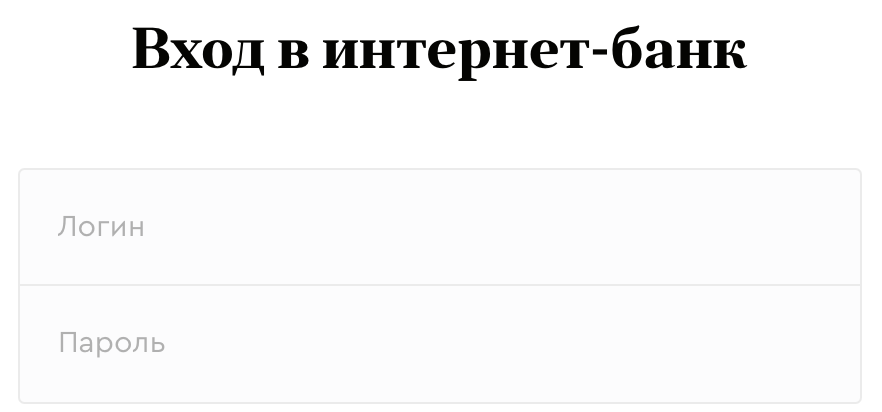
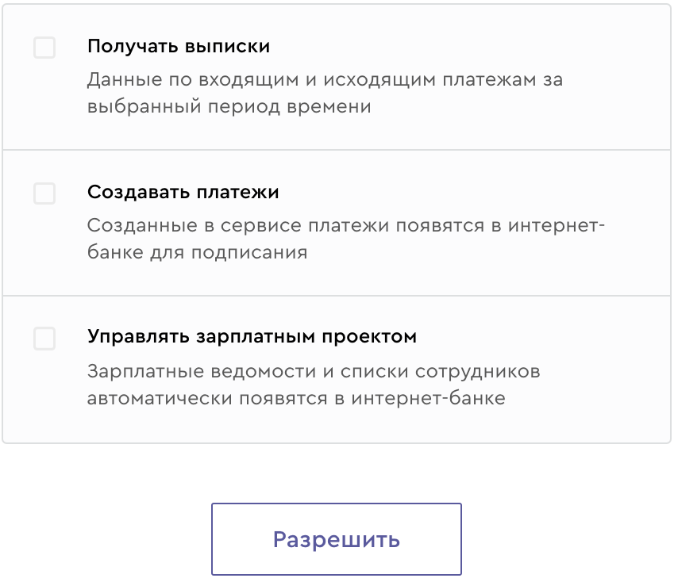

#### 1. Составь тест-кейсы на тестирование формы авторизации
В Точке есть открытое API, которое позволяет клиентам объединить сервисы Точки со своими приложениями. Конечно, есть документация по ней, в которой можно найти все необходимое для работы с интерфейсом.Так же, присутствует режим Песочницы, созданный для тестирования и разработки приложений, вне рабочей среды.
- Открытая песочница: https://enter.tochka.com/doc/v1/sandbox.html
- Выписка: https://enter.tochka.com/doc/v1/statement.html

#### 2. Составь тест-кейсы на тестирование формы получения прав доступа. Ожидаемый результат: получение кода (http://localhost:8000/?code=xcxw3Ko1XWGEL32mdLP1xcVSb151IvxB)

#### 3. Изучи документацию по выписке, пункт “Создание запроса” (https://enter.tochka.com/doc/v1/statement.html#id2). Напиши тестовую документацию по этому пункту. 
по возможности проведи тесты по своей документации и покажи их результаты.
