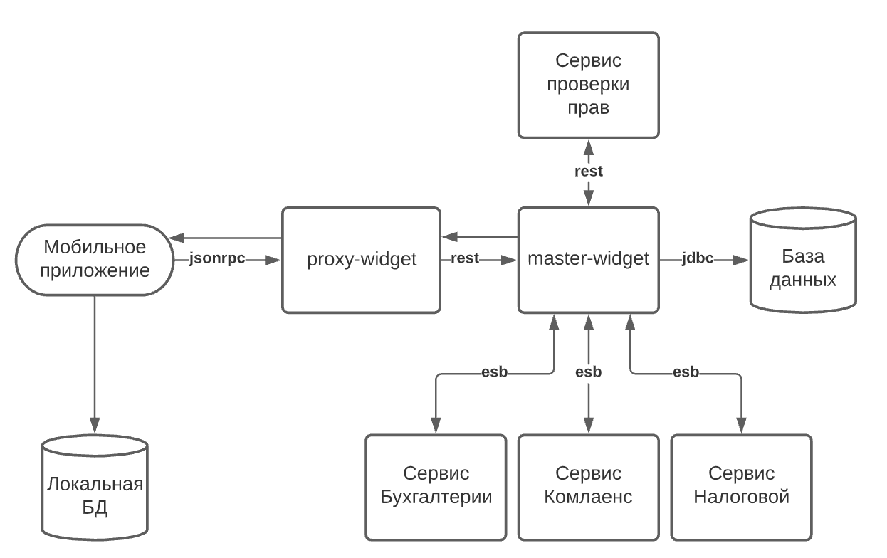

#### 1. Автоматизация API-тестов 
У нас очень много сервисов, состояние которых нам нужно знать каждый день.  Это помогает нам экономить время и не проходить каждый день руками тест-планы. Твоя задача - изучить документацию по выписке, пункт “Создание запроса” (https://enter.tochka.com/doc/v1/statement.html#id2) и написать на это дело авто-тесты, на любом удобном тебе иструменте, чтобы тесты катались с наименьшими затратами по времени.

Результаты крайне рекомендуем опубликовывать в публичном репозитории, там же расскажи почему выбрал именно этот иструмент, а не какой-нибудь другой.
При выборе нестандартного иснтрумента - опиши в readme как запускать твои тесты.

#### 2. К кому пойти в случае дефекта
Задание:
В мобильном приложении появился функционал отображения виджетов, при клике на которые вы переходите в меню конкретного сервиса и вам передали данную задачу на тестирование.
 Приступив к тестированию данной задачи вы обнаруживаете ошибку (приложение вылетает) в мобильном приложении.

Нужно выяснить, на кого из программистов повесить ошибку. 
Опишите шаги, которые нужно для этого сделать.
Схема  приложения: 
